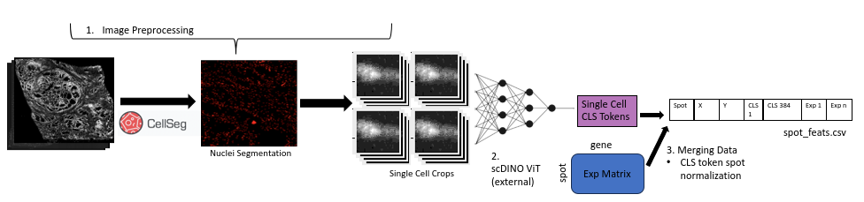
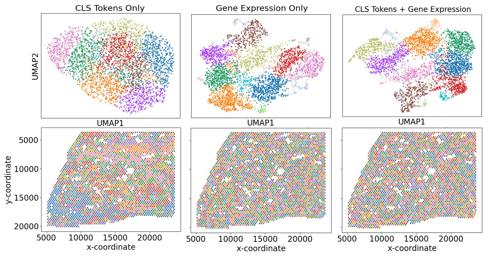

# stMorph

<br>

stMorph is a tool for integrating spatial transcriptomics gene expression data with machine learned single-cell image features utilizing [CellSeg](https://michaellee1.github.io/CellSegSite/index.html) nuclei segmentation and [scDINO](https://github.com/JacobHanimann/scDINO) vision transformer. We use scDINO's pre-trained self-supervised model to extract flattened image features in the form of a CLS token vector. 
Inputs for stMorph include tiff image file (the example uses 3-channel H&E stained data from [10X Visium entry](https://www.10xgenomics.com/cn/resources/datasets/human-prostate-cancer-adjacent-normal-section-with-if-staining-ffpe-1-standard), spot center coordinates for in-tissue spots, and a gene expression matrix (dimensions = spots x genes). 
The final step outputs a pandas dataframe with spot coordinates, spot level normalized CLS tokens, and gene expression values to be used for downstream tasks. 
<br>


## Step 1: Image pre-processing (scripts/run_dino_prep.py)
prep_dino.py inputs a multichannel tiff image, tiles performs CellSeg nuclei segmentation and outputs single cell image crops and cell center coordinates
<br>

Note: this step should be run in the CellSeg conda environment 
<br>

``` img =  # "Path to image tiff file"
output_dir = #"Output directory for cell segmentation and crops". 
numx = 4 #Number of tiles along x-axis of image
numy = 2 #Number of tiles along y-axis of image
channel_names =  #Text file for image channel names"
add_channels = True #Add empty channels to images
num_channels = 2 #Adding 2 channels to 3 channel cell images to be compatible with pretraind scDINO 5 channel model

run_cell_seg(img, output_dir, numx,numy,channel_names)
prep_dino(img, "%s/output/quantifications" % output_dir ,4,2,2,50, "%s/cell_crops" % output_dir, add_channels, num_channels)
```
* Tiles refers to how many chunks to break image into in order to be processed in CellSeg (recommended limit ~ 14,000 cells per tile)
* Adding blank channels to image crops is needed in order to use scDINO's pretrained model (channels must sum to 5)

## Step 2: Image feature extraction using scDINO ViT
This step is run in the scDINO repository, inputting single cell image crops outputted by step 1 and outputting CLS tokens for each cell. 
Reference scDINO configuration and snakemake command available in scDINO_ref folder.
<br>

### Example scDINO submission:
``` snakemake -s only_downstream_snakefile --until compute_CLS_features --configfile="configs/only_downstream_analyses.yaml" --cores all```

## Step 3: Integrating data types (scripts/merge_data.py)
merge_data.py integrates CLS tokens outputed by scDINO with gene expression data into a single dataframe. As there are not a consistent number of cells/spot, CLS tokens are normalized across cells in each spot.
<br>

# Results

Results of clusterering CLS tokens and gene expression at the spot level for 10X Prostate Cancer Example (scripts/cluster.py). 
Gene expression preprocessing, UMAP, and leiden clustering performed by scanpy.
Clusters plotted by UMAP values (top) and tissue image pixel coordinate values (bottom).


